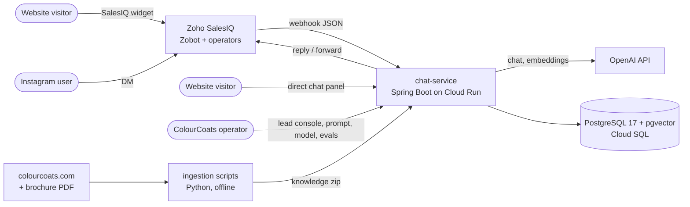
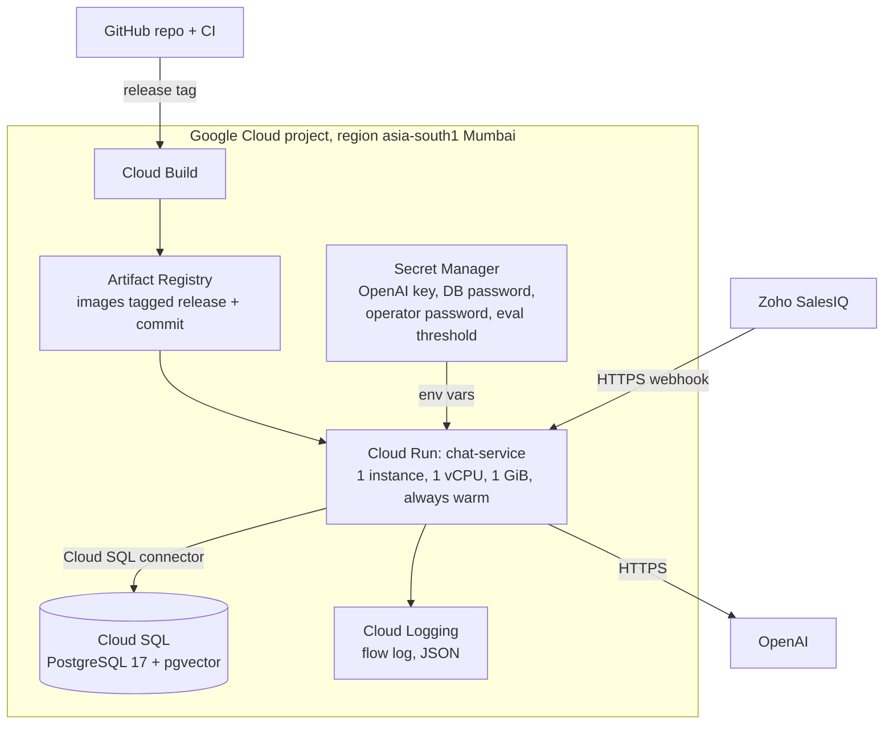
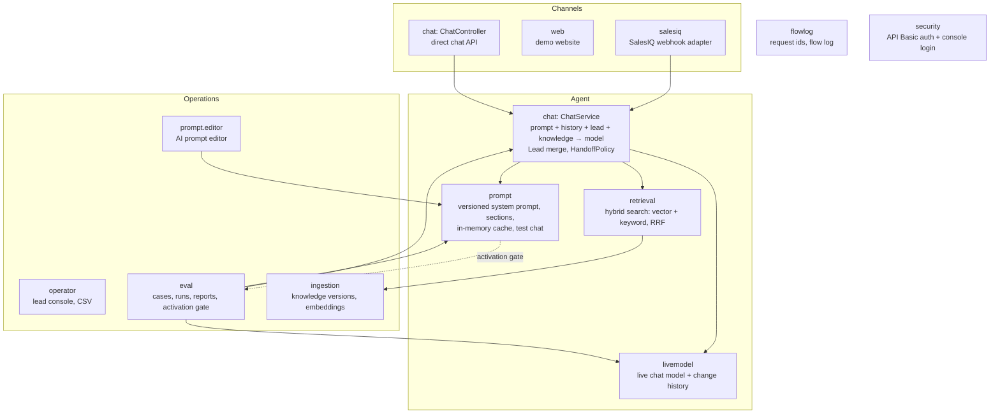
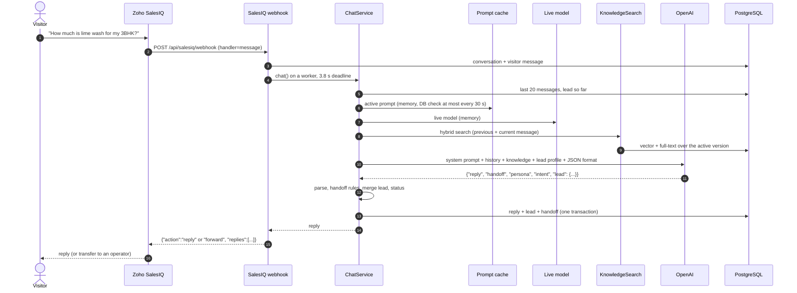
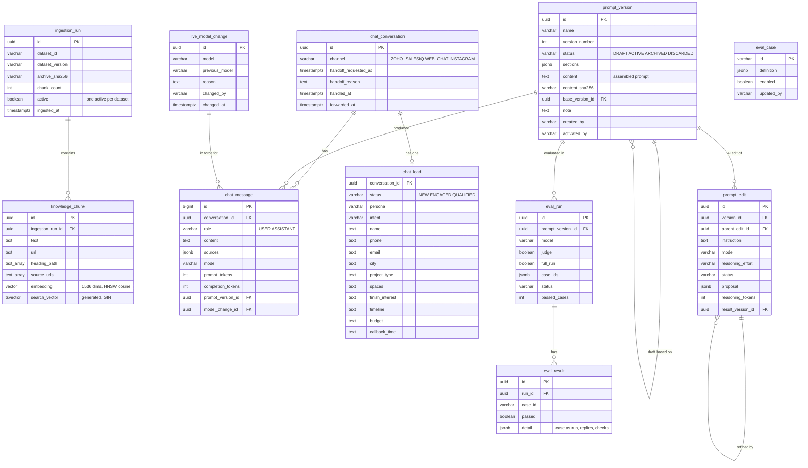
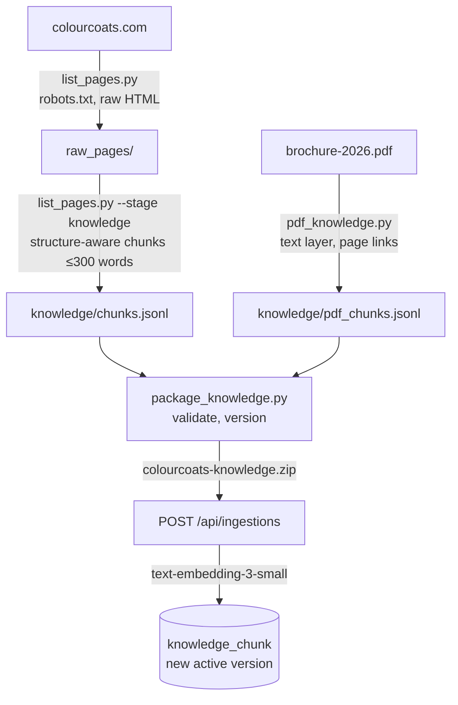
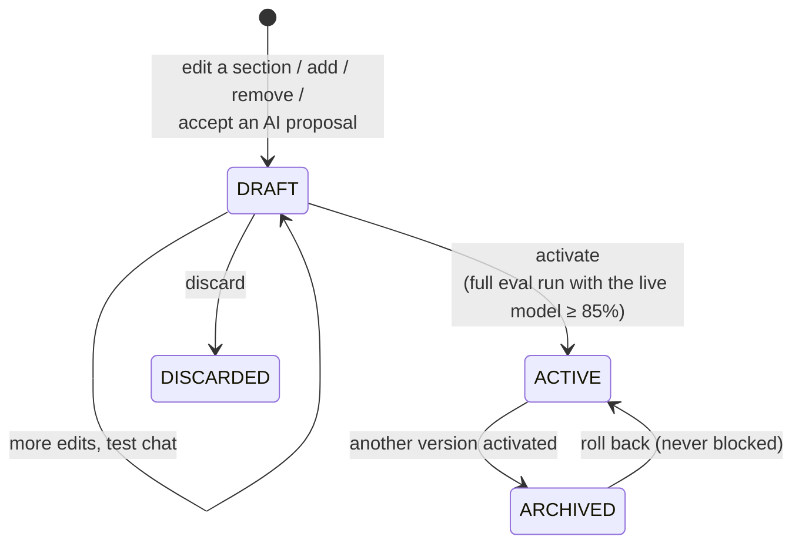
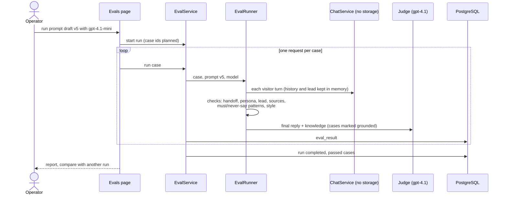

# ColourCoats AI Lead Agent: architecture

How the system is built, how a message travels through it, where data lives, and how the agent is changed safely.
The diagrams are Mermaid (rendered by GitHub). The [README](../README.md) has setup, configuration and the API.

**Contents:** [1. System context](#1-system-context) · [2. Deployment](#2-deployment-google-cloud) ·
[3. Service architecture](#3-service-architecture) · [4. A visitor message](#4-a-visitor-message-end-to-end) ·
[5. Database](#5-database) · [6. Knowledge pipeline](#6-knowledge-pipeline) ·
[7. Changing the agent safely](#7-changing-the-agent-safely) · [8. Evals](#8-evals) ·
[9. Security](#9-security) · [10. Observability](#10-observability) · [11. Demo walkthrough](#11-demo-walkthrough)

---

## 1. System context

- **Channel layer:** Zoho SalesIQ delivers website and Instagram messages and hosts the human operators.
- **Agent layer:** `chat-service` holds all agent behaviour: prompt, retrieval, qualification, handoff, lead store.
  SalesIQ is replaceable: only the webhook adapter knows its format.

## 2. Deployment (Google Cloud)

Every command used is recorded in [deploy/cloud-run.md](../deploy/cloud-run.md). Releases are git tags; the image
carries the release and commit, and `/actuator/info` shows which one is running.

## 3. Service architecture

One Spring Boot service, organised by feature (package `com.allhome.colourcoats`):

| Package | Responsibility | Key classes |
|---|---|---|
| `salesiq` | SalesIQ request/response format, 3.8 s deadline (SalesIQ waits 5 s), live transfer (`forward`) | `SalesIqWebhookController` |
| `chat` | One reply: retrieval, model call, JSON parsing, handoff rules, lead merge, saving | `ChatService`, `HandoffPolicy`, `Lead`, `ChatRepository` |
| `retrieval` | Hybrid search over the active knowledge version | `KnowledgeSearch`, `ReciprocalRankFusion` |
| `ingestion` | Upload, validate, embed and version knowledge; one active version per dataset | `IngestionService`, `KnowledgeArchiveReader` |
| `prompt` | System prompt versions in sections, drafts, activation, rollback, cache, test chat | `PromptService`, `PromptDocument` |
| `prompt.editor` | AI that proposes prompt edits, with a model and reasoning effort chosen by the operator | `PromptEditorService`, `EditorModels` |
| `livemodel` | Which model answers visitors; changes need a reason | `LiveModelService` |
| `eval` | Eval cases, case-by-case runs, reports, the activation gate | `EvalService`, `EvalRunner` |
| `operator` | Lead console: filters, transcript, persona correction, CSV | `OperatorController`, `LeadRepository` |
| `flowlog` | Request ids and the step-by-step flow log | `FlowLog`, `TraceContext` |
| `security` | Two filter chains: stateless Basic auth for `/api`, form login + CSRF for the console | `SecurityConfiguration` |

## 4. A visitor message, end to end

- **What the visitor sees** is only `reply`. Persona, intent, lead and handoff reason stay on the server.
- **Lead merge rules (code, not the model):** new non-empty values win; empty values never erase; persona and intent
  only from the known labels; status is computed: QUALIFIED = name + phone + city + persona + requirement.
- **Handoff:** the model decides (continue → offer → handoff); `HandoffPolicy` forces it for explicit requests for a
  person or call and for complaints. On SalesIQ a handoff becomes a live transfer and the reply loses its question.
- **Why 3.8 s:** SalesIQ waits at most 5 s for a webhook answer (Zoho's documented limit); 3.8 s for the agent leaves
  about 1.2 s for the network both ways and for reading and writing the request. A judgement, configurable as
  `salesiq.response-deadline-ms`.
- **Failure paths:** unparseable model output → fallback reply + handoff; slower than 3.8 s → holding message +
  handoff; SalesIQ always gets a valid answer.
- **Each stored reply records** the model, prompt version and model change that produced it.

## 5. Database

PostgreSQL 17 with pgvector, schema owned by Flyway (`db/migration`, V1–V8). Hibernate only validates it.

| Group | Tables | Rules enforced by the database |
|---|---|---|
| Knowledge | `ingestion_run`, `knowledge_chunk` | Every version kept; a partial unique index allows one active version per dataset; HNSW index for vectors, GIN for full text |
| Conversations and leads | `chat_conversation`, `chat_message`, `chat_lead` | One lead per conversation; deleting a conversation deletes its messages and lead |
| Agent configuration | `prompt_version`, `prompt_edit`, `live_model_change` | One active prompt per name (partial unique index); every version, AI request and model change kept |
| Evals | `eval_case`, `eval_run`, `eval_result` | One result per case per run (unique), so a case is never counted twice |

## 6. Knowledge pipeline

Retrieval: vector search (meaning) and PostgreSQL full-text search (exact names) over the active version, merged with
Reciprocal Rank Fusion; up to 6 chunks reach the model. Rollback = activate an earlier version.

## 7. Changing the agent safely

What visitors get is controlled by two settings, both changeable in the console without a deploy:

| Change | Where | Safeguards |
|---|---|---|
| **Prompt** (behaviour rules) | Agent prompt page: sections, manual edit, add/remove section, Ask AI | Locked sections (input, output) never change; protected sections (grounding, persona, intent) need confirmation and cannot be removed; always a draft; diff per section; test chat; eval gate before activation; one-click rollback |
| **AI-assisted prompt edit** | Ask AI panel | Operator picks model and reasoning effort; the AI's proposal is checked in code (locked, unknown, empty and no-op changes dropped), shown as a diff and only goes into a draft |
| **Live model** | Agent model page | Allowed non-reasoning models only (SalesIQ's 3.8 s), warning, reason ≥ 15 characters, confirmation, full history |
| **Knowledge** | Upload API | Validated before storing; versioned; rollback |
| **Code** (handoff rules, lead fields, deadlines) | Pull request | CI (all tests), release tag, deploy |

A new prompt or model applies from each conversation's **next** message. The prompt is cached in memory; activating
updates the cache at once (other instances within 30 s).

## 8. Evals

- Checks test **behaviour and properties**, never exact wording.
- A case **passes** when its behaviour checks pass; the judge and style checks are shown (REVIEW) but do not count.
- **Gate:** a draft is activated only after a full run with the live model passed `EVAL_ACTIVATION_MIN_PASS_RATE`
  (85%) of the cases.
- The same runner and cases run from the command line: `./mvnw test -Pevals`.

## 9. Security

| Area | Protection |
|---|---|
| `/api/**` | Stateless HTTP Basic (operator); public: `POST /api/chat`, `POST /api/salesiq/webhook`, health, info |
| Console (`/leads`, `/prompts`, `/agent-model`, `/evals`) | Form login with session and CSRF tokens |
| Secrets | Secret Manager, injected as environment variables; never in git or the image |
| SalesIQ webhook | **Not authenticated** in this demo: SalesIQ's webhook signing ("Secure your webhook") is not set up (see README, Limitations) |
| Untrusted text | Visitor messages and knowledge are data, not instructions (locked prompt rule); pages escape all text; CSV export neutralises spreadsheet formulas |

## 10. Observability

**How logs reach Cloud Logging:** nothing in the code sends logs anywhere. Cloud Run collects whatever the container
writes to its console and stores it in Cloud Logging. In the `cloud` profile every log line, including the flow log, is
written to the console as one JSON object (ECS format), so each field (`request_id`, `flow_step`, the payloads) is
searchable under `jsonPayload`. Locally the same lines go to `chat-service/logs/chat-service.jsonl`.

| Question | Where to look |
|---|---|
| What exactly did SalesIQ send and receive? | Flow log `salesiq.request` / `salesiq.response` |
| What did the model get and return, with which model and prompt version? | Flow log `openai.request` (prompt, model, `model_change_id`, prompt version) / `openai.response` (raw JSON, tokens, duration) |
| One message across all steps | Cloud Logging, Logs Explorer: `jsonPayload.request_id="<id>"` (also the `X-Request-Id` header) or `jsonPayload.conversation_id` |
| A conversation and its lead | Lead console `/leads/{id}`: transcript with model and prompt version per reply |
| What knowledge would be retrieved? | `GET /api/search?q=…` |
| Which code is running? | `/actuator/info` (version + commit) |
| Who changed the prompt, model or eval cases, and why? | Prompt versions and notes, `prompt_edit`, `live_model_change`, `eval_case.updated_by` |

## 11. Demo walkthrough

1. **Website chat** (SalesIQ widget): ask about lime wash, give name, phone and city, ask for a call → qualified lead,
   live transfer.
2. **Instagram DM** to the connected account: same agent, shorter replies.
3. **Lead console** `/leads`: the lead, its status, the transcript with model and prompt version per reply, CSV.
4. **Flow log** in Cloud Logging: follow one `request_id` through SalesIQ → OpenAI → SalesIQ.
5. **Change the agent:** Agent prompt → Ask AI ("with architects, use precise finish terms") → review the diff →
   accept into a draft → try it in the test chat.
6. **Prove it did not break anything:** Evals → run the draft → report → compare with the active version's run →
   activate (the gate allows it at 85%+).
7. **Roll back** to the previous version in one click; show the version history.
8. **Agent model:** change the live model with a reason; show the history and the model under the next reply.
